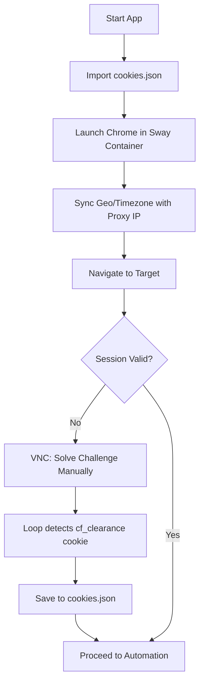

# Zen-Stealth 🕵️‍♂️

**Zen-Stealth** is an industrial-grade browser automation suite designed to bypass sophisticated anti-bot systems like Cloudflare Turnstile. It leverages a containerized Chrome environment running on a full Wayland/Sway display server, combined with advanced CDP (Chrome DevTools Protocol) stealth patches and human-like behavioral simulation.

---

## 🏗️ System Architecture: How it Works

The project works by creating a "Synthetic Human" environment. Instead of a simple headless script, it creates a full Linux desktop session inside a container, making the browser indistinguishable from a real user on a workstation.

### 1. The Environment Layer (`Dockerfile` & `docker-compose.yml`)
- **Compositor:** Uses **Sway** (Wayland) and **Xwayland** to provide a real graphical display server. This is critical because modern anti-bots check if the browser has a valid rendering context.
- **VNC Access:** Emits a VNC stream at port 5910 via `wayvnc`, allowing "Human-in-the-Loop" interaction for solving initial challenges.
- **Persistence:** Volume mounts `cookies.json` and `.env` from the host to ensure that once a session is "warmed," it stays warm even after container restarts.

### 2. The Orchestration Layer (`ghost_browser.py`)
This is the "Brain" of the project. It handles:
- **CDP Lifecycle:** Configures `zendriver` to connect to Chrome with specific flags (`no-sandbox`, custom binary paths).
- **Session Injection:** Reads the host-side `cookies.json` and injects them via the `Network.setCookie` CDP command *before* navigation starts.
- **Reactive Saving:** Runs an asynchronous loop that polls for new cookies every 15 seconds. If you solve a challenge via VNC, it detects the new `cf_clearance` token and saves it to the host immediately.

### 3. The Stealth Layer (`stealth_utils.py`)
This file handles the "Digital Makeup" of the browser:
- **Identity Syncing:** It fetches geo-data from your proxy IP and calls `Emulation.set_timezone_override`, `Emulation.set_locale_override`, and `Emulation.set_geolocation_override`. This ensures your browser's internal clock and location match your public IP.
- **Hardware Spoofing:** Injects JS to override `navigator.mediaDevices.enumerateDevices`. This prevents anti-bots from seeing "Virtual Audio" or missing device labels common in server environments.

### 4. The Behavioral Layer (`humanizer.py`)
To bypass high-entropy behavioral analysis, this module synthesizes human-like movement:
- **Bezier Mouse Control:** Uses `numpy` and `scipy` to calculate cubic Bézier curves for mouse paths, adding randomized control point offsets to mimic hand jitters.
- **Typing Cadence:** Implements a semi-stochastic delay between keystrokes (variable ms) to prevent "instant" form submission detection.

### 5. The Fail-Safe Layer (`visual_controller.py`)
When standard DOM selection fails (e.g., inside complex Shadow DOM or Canvas-based buttons), this module uses **Computer Vision**:
- **OpenCV Matching:** It can take a target image (like a button) and click it based on visual coordinate matching, bypassing the need for CSS selectors or XPaths.

---

## 🍪 The Cloudflare Bypass Flow



---

## 🛠️ How to Run

### Prerequisites
- Docker & Docker Compose.
- A VNC Client (e.g., TigerVNC).

### Workflow
1. **Initialize:** 
   ```bash
   docker-compose up --build
   ```
2. **First Solve:** Connect to `localhost:5910` (Pwd: `wayvnc`). Manually solve the Turnstile. Look for the message: `✅ (cf_clearance present!)`.
3. **Automate:** From then on, just run:
   ```bash
   docker-compose up --force-recreate
   ```
   The browser will boot, inject your "Human" session, and skip the challenge.

---

## 📜 Repository Contents
| File | Role |
| :--- | :--- |
| `ghost_browser.py` | Main entry point, CDP config, cookie loop. |
| `stealth_utils.py` | Browser identity overrides (Time/Geo/Hardware). |
| `humanizer.py` | Mouse/Keyboard behavioral synthesis. |
| `visual_controller.py` | Computer Vision fail-safe for tricky UI elements. |
| `Dockerfile` | Specialized Linux environment with Sway + Chrome. |
| `pyproject.toml` | Dependency management (zendriver, numpy, scipy). |
