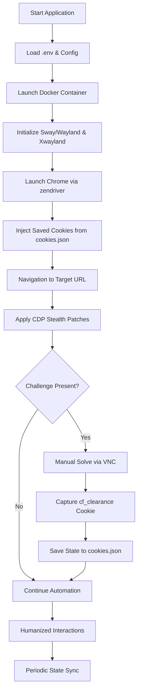

# Zen-Stealth 🕵️‍♂️

**Zen-Stealth** is an industrial-grade browser automation suite designed to bypass sophisticated anti-bot systems like Cloudflare Turnstile. It leverages a containerized Chrome environment running on a full Wayland/Sway display server, combined with advanced CDP (Chrome DevTools Protocol) stealth patches and human-like behavioral simulation.

## 🚀 Key Features

- **Dockerized Display Environment:** Runs within a Sway/Wayland container to avoid "Headless" detection flags.
- **CDP Stealth Patches:** Low-level overrides for hardware and browser identity.
- **Human-in-the-Loop Bypass:** Manual VNC solving with automated cookie persistence for subsequent runs.
- **Cookie & Session Warmth:** Automatic import/export of session tokens (`cf_clearance`).
- **Humanization Engine:** Natural mouse movement, typing cadence, and randomized delays.

---

## 🛡️ Stealth Patches & Humanization

This project implements multiple layers of protection to ensure the browser appears as a genuine human user:

### 1. Identity & Geolocation Syncing
Automatically fetches the node's public IP metadata and overrides browser properties to match the proxy's location:
- **Timezone Override:** Sets the browser timezone to match the IP locale.
- **Locale/Language Spoofing:** Matches `navigator.languages` to the expected geo-region.
- **Geolocation Mocking:** Overrides latitude/longitude to match the IP provider.

### 2. Hardware Fingerprint Spoofing
Injects scripts at document start to mock sensitive hardware APIs:
- **Media Device Enumeration:** Spoofs `navigator.mediaDevices.enumerateDevices` to return standard hardware labels (e.g., "Realtek High Definition Audio"), preventing detection via unique device IDs.

### 3. Humanizer Engine
Uses mathematical models to simulate human browsing:
- **Bézier Mouse Paths:** Mouse movements follow cubic Bézier curves instead of robotic straight lines.
- **Variable Typing Cadence:** Implements per-character delays with randomized jitter to mimic human typing speed.
- **Randomized Hesitation:** Adds variable pauses between actions to simulate "thinking time."

### 4. Non-Headless Execution
By running inside a virtual Wayland compositor (Sway), we use a standard non-headless Chrome binary. This eliminates common detection vectors like `window.navigator.webdriver` and headless-specific GPU rendering differences.

---

## 🍪 Cloudflare Turnstile Bypass via Cookies

The project uses a **Session Persistence Strategy** to overcome Cloudflare's challenges:

1. **Initial Solving:** On the first run, the user connects via VNC and solves the Turnstile challenge manually.
2. **State Capture:** The `save_cookies` loop monitors the session every 15 seconds. Once the `cf_clearance` cookie (Cloudflare's bypass token) is detected, it is immediately saved to `cookies.json`.
3. **Automated Injection:** On subsequent runs, these cookies are injected *before* navigation. The server recognizes the session as "warm" and returning, authenticated by the valid `cf_clearance` token, bypassing the challenge entirely.

---

## 📊 Project Flow



---

## 🛠️ How to Run

### Prerequisites
- Docker & Docker Compose installed.
- TigerVNC or any VNC client (for initial manual solve).

### Step 1: Configuration
Create a `.env` file from the example:
```bash
cp .env.example .env
# Edit .env with your SOCKS5_PROXY if needed
```

### Step 2: First Run (Initial Solve)
Build and start the container:
```bash
docker-compose up --build
```
1. Open your VNC client and connect to `localhost:5910` (Password: `wayvnc`).
2. Solve the Cloudflare challenge manually.
3. Once you see `✅ (cf_clearance present!)` in the terminal, you can stop the container (Ctrl+C).

### Step 3: Regular Automated Run
For subsequent runs, use the force-recreate command to ensure a clean session:
```bash
docker-compose up --force-recreate
```
Chrome will now use the saved cookies and bypass the challenge automatically.

---

## ⚙️ Project Structure

- `ghost_browser.py`: Core orchestration and cookie management.
- `stealth_utils.py`: CDP identity syncing and hardware spoofing.
- `humanizer.py`: Behavioral simulation logic.
- `Dockerfile`: Multi-stage build for a specialized browser environment.
